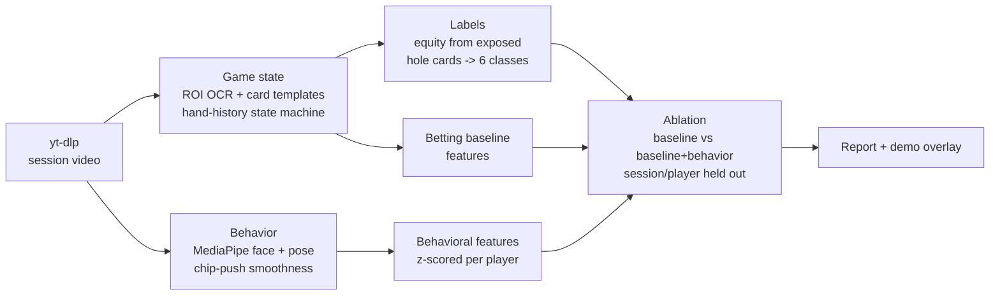

# Poker Tell Analysis

Does nonverbal behavior add predictive power over betting action alone?
An ablation study on broadcast poker footage, inspired by the AI bluff
detector featured in ESPN's 2026 WSOP coverage.

**Status: scaffold (day 0 of a one-week build).** Pipeline interfaces and the
evaluation harness are in place; the OCR, behavior extraction, and demo
stages land per the plan below.

## The question

The 2026 WSOP broadcast featured a system (built by Luke Geel for Omaha
Productions) that reads the stream, tracks player behavior, and estimates
hand-strength classes. No open-source equivalent exists. This project
replicates the pipeline on a laptop and asks the honest version of the
question: given everything the betting action already tells you (sizing,
position, street, action history), do face, posture, and chip-motion features
add measurable predictive power?

The literature says any effect is small: humans average 54% at lie detection,
the best audio-visual deception models sit at 54 to 67% accuracy, and the
strongest published poker cue is the smoothness of the betting motion
(r = .29), not the face (r = -.07, if anything deceptive). The deliverable is
a defensible delta with confidence intervals, not a magic bluff detector. See
[RESEARCH.md](RESEARCH.md) for sources.

## Pipeline



The unit of analysis is one player decision: the window from action-on-player
to action-committed. Labels come from the broadcast's own hole-card overlay
(players consented to it being shown), classed as bluff / weak draw / medium /
strong draw / strong / monster via Monte Carlo equity.

## Design decisions that matter

- **Per-player baselines.** Tells are player-specific, so every behavioral
  feature is z-scored against that player's own distribution.
- **Chip-motion smoothness first.** Slepian et al. 2013 found rated motion
  smoothness was the strongest cue (r = .29); we operationalize it as wrist
  trajectory RMS jerk and spectral arc length, One-Euro filtered.
- **Face features stay in their own ablation group.** The same study found
  face+arm fusion cancelled the arm signal.
- **Leakage guards.** Behavioral columns can never encode bet size; whole
  sessions go to one side of the split; evaluation is per decision, never per
  overlapping frame window; grouped bootstrap CIs at the hand level.
- **Betting-only baseline is the bar.** A behavioral model is only as
  interesting as its delta over position + sizing + action history.

## One-week plan

| Day | Milestone |
|-----|-----------|
| 1 | Download 2-3 HCL sessions, calibrate ROIs, PaddleOCR spike on HUD fields |
| 2-3 | Card template matching, hand-history state machine, validate vs 30+ hand-transcribed decisions |
| 4 | Face/pose extraction over decision windows, smoothness features |
| 5 | Equity labels, betting baseline, first ablation run |
| 6 | Held-out evaluation, bootstrap CIs, calibration, results writeup |
| 7 | Demo overlay clip, README results section, polish |

## Setup

Requires Python 3.12 (eval7 wheels stop at 3.12), [uv](https://docs.astral.sh/uv/),
and ffmpeg.

```sh
uv sync                 # core pipeline + dev tools
uv sync --extra ocr     # adds PaddleOCR (heavy; needed for extract-state)
uv run pytest           # unit tests
uv run pokertell --help # pipeline stages
```

## Repo layout

```
src/pokertell/
  ingest/      yt-dlp download wrapper
  gamestate/   ROI crops, HUD OCR, card templates, hand-history state machine
  behavior/    face blendshapes, pose, One-Euro filter, smoothness metrics
  labels/      Monte Carlo equity -> strength classes
  models/      betting baseline features, ablation trainer
  eval/        grouped splits, ablation metrics, calibration
  demo/        ffmpeg overlay renderer
configs/       per-show HUD ROI layouts
tests/         unit tests for all pure logic
data/          local only, gitignored (see data/README.md)
```

## Ethics and data

- Footage comes only from streams where players consented to their hole cards
  being broadcast (Hustler Casino Live). No hidden-information analysis.
- This is post-hoc analysis of published broadcasts, the same activity as
  studying a televised game. It is not built for, and must not be used for,
  real-time play. The original system's builder draws the same line.
- No footage, frames, or clips are committed or redistributed. The repo ships
  code; derived numeric features and timestamps are shareable on request.
- Findings are reported with uncertainty, including null results. Given the
  literature, a small or null behavioral effect is the expected outcome and
  will be published as such.

## Key references

- Slepian, Young, Rutchick, Ambady (2013). Quality of professional players'
  poker hands is perceived accurately from arm motions. Psychological Science.
- Bond, DePaulo (2006). Accuracy of deception judgments. PSPR.
- Denault et al. (2020). The analysis of nonverbal communication: the dangers
  of pseudoscience in security and justice contexts. Frontiers in Psychology.
- Guo et al. (2023). DOLOS: audio-visual deception detection. ICCV.
- Cross-domain audio-visual deception detection benchmark, arXiv:2405.06995.
- Feinland et al. (2022). Poker bluff detection dataset based on facial
  analysis. ICIAP.
- Geel, L. (2026). AI Insider: Can your poker tells be hacked? PokerOrg.

Full annotated findings: [RESEARCH.md](RESEARCH.md).
