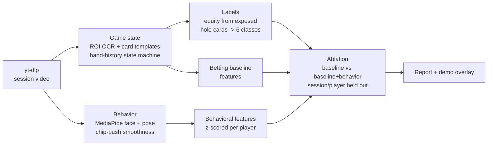

# Poker Tell Analysis

Does nonverbal behavior add predictive power over betting action alone?
An ablation study on broadcast poker footage, inspired by the AI bluff
detector featured in ESPN's 2026 WSOP coverage.

**Status: day 3 of a one-week build.** Game-state extraction works end to
end on real footage: broadcast HUD OCR, card sprite recognition, and the
hand-history assembler that folds the snapshot stream into Hand records
with per-decision windows. 24 minutes of test footage across two sessions
reconstructs into 16 hands with 112 decisions, 68 of them with exact
action-on-player to action-committed windows. Behavior extraction, models,
and the demo land per the plan below.

## The question

The 2026 WSOP broadcast featured a system (built by Luke Geel for Omaha
Productions) that reads the stream, tracks player behavior, and estimates
hand-strength classes. No open-source equivalent exists. This project
replicates the pipeline on a laptop and asks the honest version of the
question: given everything the betting action already tells you (sizing,
position, street, action history), do face, posture, and chip-motion features
add measurable predictive power?

The literature says any effect is small: humans average 54% at lie detection,
the best audio-visual deception models sit at 54 to 67% accuracy, and the
strongest published poker cue is the smoothness of the betting motion
(r = .29), not the face (r = -.07, if anything deceptive). The deliverable is
a defensible delta with confidence intervals, not a magic bluff detector. See
[RESEARCH.md](RESEARCH.md) for sources.

## Results (two full sessions, 11 hours of broadcast)

Data: two complete Hustler Casino Live sessions (Jul 2026 and Feb 2026),
38,231 HUD snapshots, 333 assembled hands, 2,890 decision windows, 2,510 of
them with Monte Carlo equity labels from the exposed hole cards. Behavioral
features exist for 442 decision windows across the two mapped players (Nik
Airball in both sessions, Suited Superman in one); a window is covered only
when the player's seat camera is on air and face re-identification accepts
the frames. Evaluation is leave-one-session-out (LOSO): train on one
session, test on the other, pool the out-of-fold predictions.

| Ablation arm | Target | n | delta AUC over betting-only (95% CI) |
|--------------|--------|---|--------------------------------------|
| + face and pose features | is_weak | 186 | +0.009 [-0.058, +0.074] |
| + event detectors only | is_weak | 186 | -0.032 [-0.113, +0.046] |
| + all behavior | is_weak | 186 | -0.033 [-0.143, +0.072] |
| + face and pose features | is_bluff | 78 | -0.022 [-0.169, +0.136] |
| + event detectors only | is_bluff | 78 | -0.007 [-0.117, +0.099] |
| + all behavior | is_bluff | 78 | +0.019 [-0.131, +0.185] |

The betting-only baseline scores AUC 0.55 on all 670 labeled aggressive
decisions (cross-session; the same model scores 0.75 within-session).

**Preregistered replication (iteration 4): FAILED, decisively.** Two new
sessions (Jul 4 and Apr 25, 2026) were selected, seat-mapped with
commit-moment evidence, and distractor-audited before any model output,
under a preregistered analysis plan (docs/prereg_iteration4.md) committed
before the footage was downloaded. The pooled four-session test of the
face-and-pose hypothesis returned delta AUC -0.075 with a hand-grouped
bootstrap 95% CI of [-0.134, -0.020]: behavioral features not only fail
to add out-of-session predictive power at this scale, they measurably
subtract it, which is what noisy added dimensions do to a small model.

The honest reading is the story of an artifact, and it is the project's
most instructive result.

**A behavioral "effect" appeared, strengthened, and then vanished as
identity attribution was progressively cleaned.** On the original tables,
where a lookalike neighbor's face was sometimes silently attributed to the
tracked player, adding face and pose features read as delta +0.044 (CI
including zero). After distractor references were added but while a
wrong-person chip still sat inside each session's positive reference
library, the delta read +0.096 with a CI excluding zero, which briefly
looked like the project's first resolvable effect. With enrollment made
deterministic, position-bounded, and every reference chip visually
verified, the delta is +0.009 with a CI comfortably spanning zero. The
apparent signal was cross-player contamination: another player's face,
measured during the tracked player's decisions, correlates with decision
context in ways that imitate a behavioral tell. Identity hygiene did not
just beat feature engineering, it was the entire observed effect.

**Every arm is now a null at this sample size.** Face and pose, the event
detectors, and their union all land inside noise on both targets. The
event detectors (downward gaze rate, hand near face, freeze, chip shuffle
periodicity, forward lean) were built bet-size leakage-proof and are
shipped as an honest null.

**What it would take to find a real effect** is unchanged by any of this:
an order of magnitude more covered decisions, meaning 15 to 20 more
sessions, plus the identity discipline this project now enforces
(deterministic enrollment, distractor registration, chip-level visual
verification). Two structural findings stand: cross-session
generalization is brutal (betting baseline 0.75 within-session falls to
0.55 across sessions), and camera coverage binds everything behavioral
(clean face coverage runs about 29 to 33 percent for the primary player;
a player in mirrored sunglasses drops to 4 percent). A preregistered
replication on unseen sessions (docs/prereg_iteration4.md) is in
progress; under the now-null in-sample estimate its expected outcome is
a failed replication, and it will be reported either way.

Calibration plot: [docs/reliability.png](docs/reliability.png). Full tables
regenerate with `pokertell report`.

## Pipeline



The unit of analysis is one player decision: the window from action-on-player
to action-committed. Labels come from the broadcast's own hole-card overlay
(players consented to it being shown), classed as bluff / weak draw / medium /
strong draw / strong / monster via Monte Carlo equity.

## Design decisions that matter

- **Per-player baselines.** Tells are player-specific, so every behavioral
  feature is z-scored against that player's own distribution.
- **Chip-motion smoothness first.** Slepian et al. 2013 found rated motion
  smoothness was the strongest cue (r = .29); we operationalize it as wrist
  trajectory RMS jerk and spectral arc length, One-Euro filtered.
- **Face features stay in their own ablation group.** The same study found
  face+arm fusion cancelled the arm signal.
- **Leakage guards.** Behavioral columns can never encode bet size; whole
  sessions go to one side of the split; evaluation is per decision, never per
  overlapping frame window; grouped bootstrap CIs at the hand level.
- **Betting-only baseline is the bar.** A behavioral model is only as
  interesting as its delta over position + sizing + action history.

## One-week plan

| Day | Milestone |
|-----|-----------|
| 1 | Download 2-3 HCL sessions, calibrate ROIs, PaddleOCR spike on HUD fields |
| 2-3 | Card template matching, hand-history state machine, validate vs 30+ hand-transcribed decisions |
| 4 | Face/pose extraction over decision windows, smoothness features |
| 5 | Equity labels, betting baseline, first ablation run |
| 6 | Held-out evaluation, bootstrap CIs, calibration, results writeup |
| 7 | Demo overlay clip, README results section, polish |

## Demo clips

`pokertell demo` renders one decision window with the pipeline's full view
burned on top: the assembled game state with a decision-time bar, the face
re-identification box with its live chip score, eye, brow and lip contours
with a gaze arrow, head-facing arrow and expression tags from the
landmarks the features are computed from, a One-Euro smoothed trail of the
acting wrist, a live blink counter, the window's behavioral z-scores
labeled against the player's own baseline, the held-out six-class
hand-strength distribution, and P(bluff) for the betting baseline next to
baseline + behavior. The clip freezes on a hole-card and equity reveal.
The six-class panel is deliberately uncalibrated held-out output; when it
overcommits on a bluff, that is the cross-session transfer problem making
the project's own argument.

```
pokertell demo data/raw/loAuriiBRCk.mp4 --hand-id "loAuriiBRCk#0111" --t-end 14499
```

Rendered clips stay local under data/demo (see Ethics and data); the two
showcase windows are Airball's turn raise at 10 percent equity
(loAuriiBRCk#0111, a genuine bluff) and his flop raise at 77 percent
(osFhAW7BFMs#0048, the contrast case). On the bluff clip the behavior
model actually moves the estimate the wrong way, which is exactly what a
null aggregate delta looks like at the level of a single hand.

## Setup

Requires Python 3.12 (eval7 wheels stop at 3.12), [uv](https://docs.astral.sh/uv/),
and ffmpeg.

```sh
uv sync                 # core pipeline + dev tools
uv sync --extra ocr     # adds PaddleOCR (heavy; needed for extract-state)
uv run pytest           # unit tests
uv run pokertell --help # pipeline stages
```

## Repo layout

```
src/pokertell/
  ingest/      yt-dlp download wrapper
  gamestate/   ROI crops, HUD OCR, card templates, hand-history state machine
  behavior/    face blendshapes, pose, One-Euro filter, smoothness metrics
  labels/      Monte Carlo equity -> strength classes
  models/      betting baseline features, ablation trainer
  eval/        grouped splits, ablation metrics, calibration
  demo/        ffmpeg overlay renderer
configs/       per-show HUD ROI layouts
tests/         unit tests for all pure logic
data/          local only, gitignored (see data/README.md)
```

## Ethics and data

- Footage comes only from streams where players consented to their hole cards
  being broadcast (Hustler Casino Live). No hidden-information analysis.
- This is post-hoc analysis of published broadcasts, the same activity as
  studying a televised game. It is not built for, and must not be used for,
  real-time play. The original system's builder draws the same line.
- No footage, frames, or clips are committed or redistributed. The repo ships
  code; derived numeric features and timestamps are shareable on request.
- Findings are reported with uncertainty, including null results. Given the
  literature, a small or null behavioral effect is the expected outcome and
  will be published as such.

## Key references

- Slepian, Young, Rutchick, Ambady (2013). Quality of professional players'
  poker hands is perceived accurately from arm motions. Psychological Science.
- Bond, DePaulo (2006). Accuracy of deception judgments. PSPR.
- Denault et al. (2020). The analysis of nonverbal communication: the dangers
  of pseudoscience in security and justice contexts. Frontiers in Psychology.
- Guo et al. (2023). DOLOS: audio-visual deception detection. ICCV.
- Cross-domain audio-visual deception detection benchmark, arXiv:2405.06995.
- Feinland et al. (2022). Poker bluff detection dataset based on facial
  analysis. ICIAP.
- Geel, L. (2026). AI Insider: Can your poker tells be hacked? PokerOrg.

Full annotated findings: [RESEARCH.md](RESEARCH.md).
