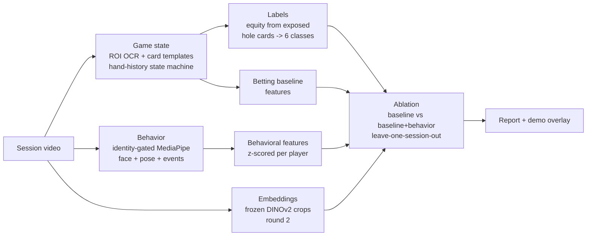

<p align="center">
  <a href="media/demo_5VALaTpNrdE_0120.mp4"></a>
</p>
<p align="center"><em>The demo renderer on a river decision from the October 2025 session: identity-gated face attribution with its re-identification score, MediaPipe landmarks, gaze vector, acting-wrist path, live event tags, and held-out model probabilities, rendered over the source broadcast. Click for the <a href="media/demo_5VALaTpNrdE_0120.mp4">full clip</a>.</em></p>

# MediaPipe and DINOv2 Representations for Hand-Strength Prediction in Broadcast Poker

Televised poker commentary and a recent broadcast "AI bluff detector"
popularized the claim that nonverbal behavior reveals hand strength on
camera. This repository holds the pipeline, analysis code, seat maps,
audit tooling, and frozen preregistrations behind a paper that tests
that claim end to end: does adding automatically extracted nonverbal
behavior improve prediction of hand strength over the betting action
alone, evaluated out of session, on public footage?

## Findings

- **An identity-contamination artifact is the central methodological
  result.** Under progressively stricter face-attribution hygiene, an
  apparent behavioral effect first strengthened to a nominally
  resolvable delta AUC of +0.096 (95% CI [+0.005, +0.181]) and then
  vanished entirely (+0.009, [-0.058, +0.074]) once every enrolled
  reference face was verified. The spurious effect was produced by
  frames in which a lookalike neighbor was silently credited to the
  tracked player.
- **A preregistered replication decisively failed.** With the analysis
  frozen before the new footage was downloaded, face and pose features
  change out-of-session AUC by -0.075 (95% CI [-0.134, -0.020], n=292),
  with approximately 91% power to detect the registered +0.096.
- **The negative is an inversion, not noise.** A behavior-only model
  scores AUC 0.349 out of session, below chance under a hand-level
  permutation test (p = 0.018), and no regularization scheme rescues
  the features. No behavioral feature keeps its fitted sign across all
  four round 1 sessions.
- **Tells are session-local.** In a second preregistered round on eight
  sessions, within-session behavior-only AUC resolved positive at 0.587
  (95% CI [0.515, 0.655], n=494), while cross-session transfer stays at
  or below chance (0.430, [0.358, 0.502]). Tells exist and are
  machine-readable within a session, and they do not transfer across
  sessions.
- **A learned representation does not change the answer.** A
  preregistered frozen DINOv2 probe adds +0.012 over betting action out
  of session (CI [-0.079, +0.103], n=257), extending the conclusion
  from hand-crafted features to a standard learned representation.
- **Decision timing is bounded.** The most cited poker tell, tank
  duration, needs no camera and is bounded below +0.01 AUC over betting
  action at n=4,815.

The conclusion the paper draws: identity hygiene, not feature
engineering, is the binding methodological risk for behavioral video
datasets built on multi-person footage, and behavioral hand-strength
models of this class do not generalize across sessions.

## Data

Eight complete Hustler Casino Live cash-game sessions (October 2025 to
July 2026, 46.6 hours) featuring one high-volume professional in all
eight. The stream exposes hole cards in its graphics, providing ground
truth without any inference from behavior. The pipeline reduces the
footage to a labeled decision-level dataset:

| Stage | Count |
|---|---|
| Hours of broadcast | 46.6 |
| Game-state snapshots (1 Hz OCR) | 160,753 |
| Assembled hands | 1,461 |
| Decision windows | 12,417 |
| Decisions with Monte Carlo equity labels | 9,801 |
| Camera-covered decisions entering ablations | 494 |

The last row is the honest cost of broadcast footage: behavior can be
measured only when the camera shows the player, and coverage is set by
the broadcast director, not by the researcher. Raw footage and derived
data stay local by design and are never committed.

## Pipeline


```mermaid
flowchart LR
    A[Session video] --> B[Game state<br>ROI OCR + card templates<br>hand-history state machine]
    A --> C[Behavior<br>identity-gated MediaPipe<br>face + pose + events]
    A --> I[Embeddings<br>frozen DINOv2 crops<br>round 2]
    B --> D[Labels<br>equity from exposed<br>hole cards -> 6 classes]
    B --> E[Betting baseline<br>features]
    C --> F[Behavioral features<br>z-scored per player]
    D --> G[Ablation<br>baseline vs baseline+behavior<br>leave-one-session-out]
    E --> G
    F --> G
    I --> G
    G --> H[Report + demo overlay]
```

The unit of analysis is one player decision: the window from
action-on-player to action-committed. Each stage is a CLI subcommand,
and later stages resume from checkpoints:

| Command | What it does |
|---|---|
| `pokertell extract-state VIDEO` | Region-cropped PP-OCRv6 OCR and card template matching into per-second game-state snapshots |
| `pokertell assemble SNAPSHOTS` | State machine that folds snapshots into hands and decision windows |
| `pokertell label` | Monte Carlo equity versus a random hand (deterministic seeds), six strength classes, `is_weak` and `is_bluff` targets |
| `pokertell extract-behavior VIDEO HANDS SEATS` | Identity-gated MediaPipe face and pose features plus six leakage-reviewed event detectors per decision window |
| `pokertell embed VIDEO HANDS SEATS` | Frozen DINOv2 ViT-S/14 embeddings of identity-gated face and pose crops (round 2, `embed` extra) |
| `pokertell train` | Leave-one-session-out baselines and ablations with hand-grouped bootstrap 95% CIs |
| `pokertell demo VIDEO --hand-id ID --t-end T` | Renders one decision window as the annotated overlay clip shown above |

Identity attribution follows the protocol documented in the paper:
deterministic position-bounded reference enrollment, visual
verification of every enrolled patch, a per-session sweep that
registers every above-threshold non-target face as a distractor, and
margin-based best-candidate matching. Per-session seat maps with
verified references and registered distractors live in
`configs/seats/`.

## Design decisions that matter

- **Per-player baselines.** Tells are player-specific, so every
  behavioral feature is z-scored against that player's own
  distribution.
- **Leakage guards.** Behavioral columns can never encode bet size:
  wrist smoothness metrics are amplitude-invariant by construction, and
  the event detectors are rates, fractions, ratios, or shoulder-width
  geometry. Whole sessions go to one side of every split, and CIs are
  bootstrapped at the hand level so correlated decisions within a hand
  never narrow an interval.
- **The betting-only baseline is the bar.** A behavioral model is only
  as interesting as its delta over position, sizing, pot odds, street,
  action history, and timing.
- **Simple analysis models on purpose.** With hundreds of covered
  decisions, anything more flexible than a linear probe would mostly
  measure its own variance; readable coefficients are also what make
  the per-session sign-flip analysis possible.

## The demo renderer

`pokertell demo` renders one decision window with the pipeline's full
view burned on top: the assembled game state with a decision clock, the
face attribution box with its live re-identification score, landmark
contours with gaze and head-direction vectors, event tags as they fire,
a One-Euro smoothed trail of the acting wrist, the window's behavioral
z-scores against the player's own baseline, the held-out six-class
strength distribution, and P(is_bluff) for the betting baseline next to
baseline plus behavior. The clip freezes on a hole-card and equity
reveal. The strength panel is deliberately uncalibrated held-out
output.

```
pokertell demo data/raw/5VALaTpNrdE.mp4 --hand-id "5VALaTpNrdE#0120" --t-end 19029
```

## Installation

Requires Python 3.11 or 3.12, [uv](https://docs.astral.sh/uv/), and
ffmpeg.

```sh
uv sync                 # core pipeline + dev tools
uv sync --extra ocr     # adds PaddleOCR (heavy; needed for extract-state)
uv sync --extra embed   # adds torch for the DINOv2 arm
uv run pytest           # unit tests
uv run pokertell --help # pipeline stages
```

MediaPipe models download automatically on first use.

## Preregistration and reproducibility

Both confirmatory rounds were frozen in committed preregistration
documents before any new footage was downloaded, with the results
appended afterward exactly as specified:

- [docs/prereg_iteration4.md](docs/prereg_iteration4.md): the
  replication test of the +0.096 estimate, including the logged session
  substitution and the recorded failure.
- [docs/prereg_round2.md](docs/prereg_round2.md): the DINOv2
  representation probe and the within-session resolution on eight
  sessions.

The full analysis history, including the artifact's discovery and every
estimate in the paper's Figure 2, is preserved in this repository's
commit log. Paper figures regenerate with
`paper/figures/make_figures.py`.

## Repo layout

```
src/pokertell/
  ingest/      session download wrapper
  gamestate/   ROI crops, HUD OCR, card templates, hand-history state machine
  behavior/    face blendshapes, pose, event detectors, DINOv2 embeddings
  labels/      Monte Carlo equity -> strength classes
  models/      betting baseline features, ablation trainer
  eval/        grouped splits, ablation metrics, calibration
  demo/        overlay renderer and held-out demo probabilities
configs/       per-show ROI layouts, card templates, per-session seat maps
docs/          frozen preregistrations with logged results
media/         demo clip and README assets
tests/         unit tests for all pure logic
data/          local only, gitignored (see data/README.md)
```

## Paper

Minu Choi, "MediaPipe and DINOv2 Representations for Hand-Strength
Prediction in Broadcast Poker," University of Virginia, 2026. Preprint
on Zenodo (DOI to be added upon publication).

```bibtex
@misc{choi2026handstrength,
  author       = {Choi, Minu},
  title        = {MediaPipe and DINOv2 Representations for Hand-Strength
                  Prediction in Broadcast Poker},
  year         = {2026},
  howpublished = {Zenodo preprint}
}
```

## Ethics

All footage is publicly broadcast with player consent to the stream's
hole-card exposure. The pipeline analyzes it post hoc and redistributes
no footage; the single annotated frame in the paper and the short
annotated demonstration clip above are reproduced from the public
broadcast to illustrate the system. The repository publishes code,
derived features, timestamps, and the preregistrations rather than
clips. This is post-hoc analysis of published broadcasts; it is not
built for, and must not be used for, real-time play.
